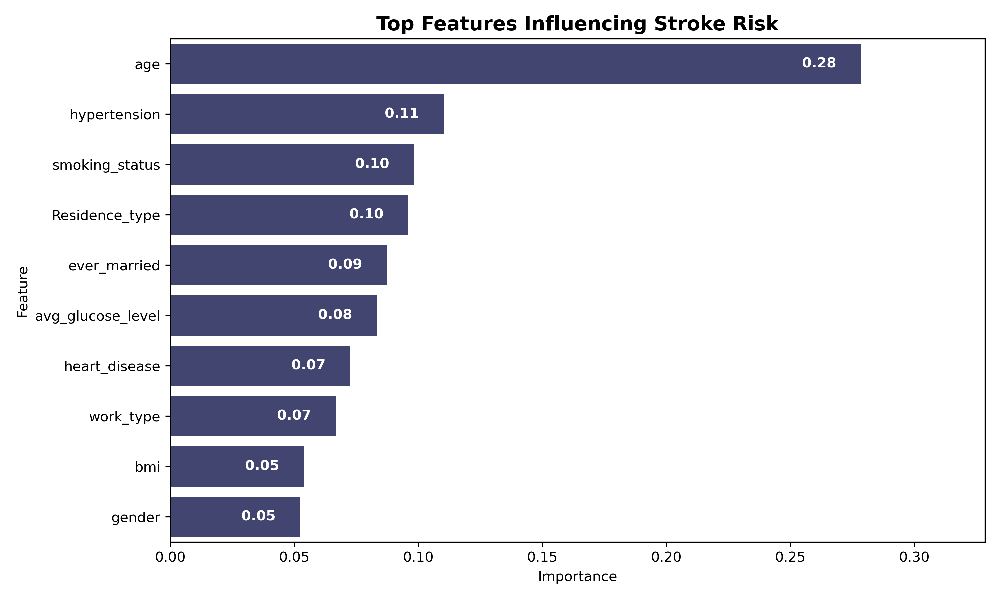
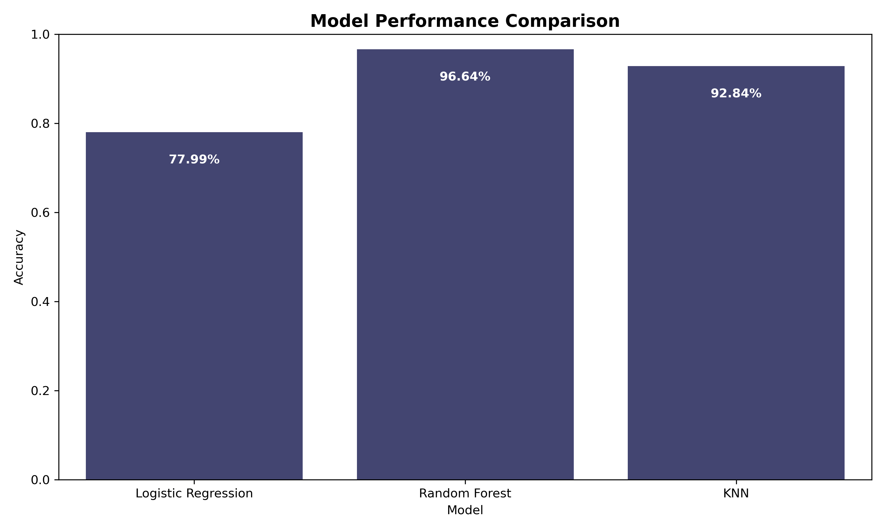
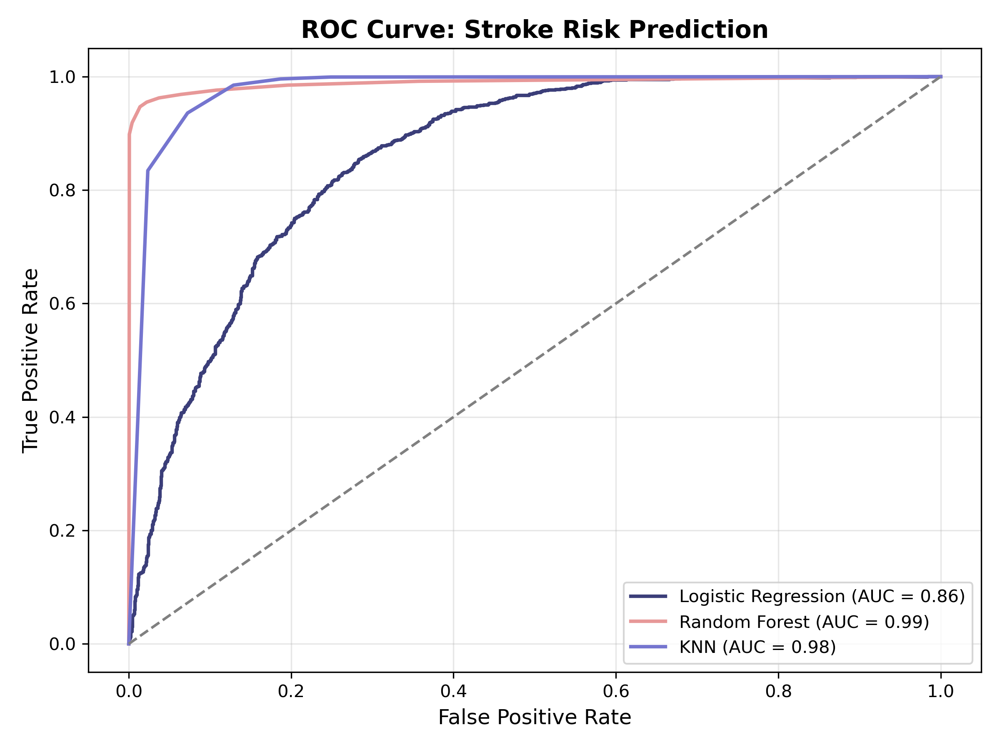

# Stroke Risk Prediction using Machine Learning

This project builds a robust machine learning pipeline to **predict stroke risk** based on clinical and lifestyle features.  
Achieved up to **97% accuracy** using **Random Forest** classifier.

---

## Tools & Libraries

- **Language**: Python  
- **Libraries**: Pandas, Scikit-learn, Matplotlib, Seaborn  
- **Models Used**:
  - Logistic Regression
  - K-Nearest Neighbors (KNN)
  - Random Forest  
- **Preprocessing**:
  - Missing value imputation
  - Label encoding
  - SMOTE for class balancing  
- **Evaluation**: Accuracy, Precision, Recall, F1, ROC Curve

---

## Pipeline Overview

1. Data cleaning and imputation
2. Categorical encoding
3. Train-test split (70/30)
4. Class balancing with **SMOTE**
5. Model training & evaluation
6. Result visualization and comparison

---

## Results

| Model               | Accuracy | Precision | Recall     | F1 Score |
|---------------------|----------|-----------|------------|----------|
| Random Forest       | 96.64%   | **98.58%**| 94.68%     | **96.59%** |
| K-Nearest Neighbors | 92.84%   | 88.54%    | **98.50%** | 93.26%   |
| Logistic Regression | 77.99%   | 76.63%    | 80.91%     | 78.71%   |

- **Top Features**: Age, Hypertension, Smoking Status

> **K-Nearest Neighbors** achieved the highest recall (98.5%), which is crucial for detecting most true stroke cases. However, its lower precision led to more false positives, reducing its overall F1-score.
> **Random Forest** offered the best balance, with excellent precision (98.58%) and high recall (94.68%), making it the most reliable model overall—especially in medical settings where both false positives and false negatives have significant consequences.   
> **Logistic Regression**, while simpler and easier to interpret, served as a useful baseline but was less effective at capturing the complex patterns in the data.

---

## Key Visualizations

### 🔹 Feature Importance  


### 🔹 Accuracy Comparison  


### 🔹 ROC Curve  


---

## Dataset

Data was obtained from the [Kaggle Stroke Prediction Dataset](https://www.kaggle.com/datasets/fedesoriano/stroke-prediction-dataset).

---

## How to Run

1. Clone the repo:
   ```bash
   git clone https://github.com/tiaf3/stroke_risk_prediction.git
   ```
2. Place the dataset CSV file inside the `data/` folder  
3. Install dependencies:
   ```bash
   pip install -r requirements.txt
   ```
4. Run the script:
   ```bash
   python stroke_prediction.py
   ```

---

## Status

✅ **Completed** – Academic/portfolio project  
Demonstrates strong ML pipeline design, performance tuning, and interpretability.
